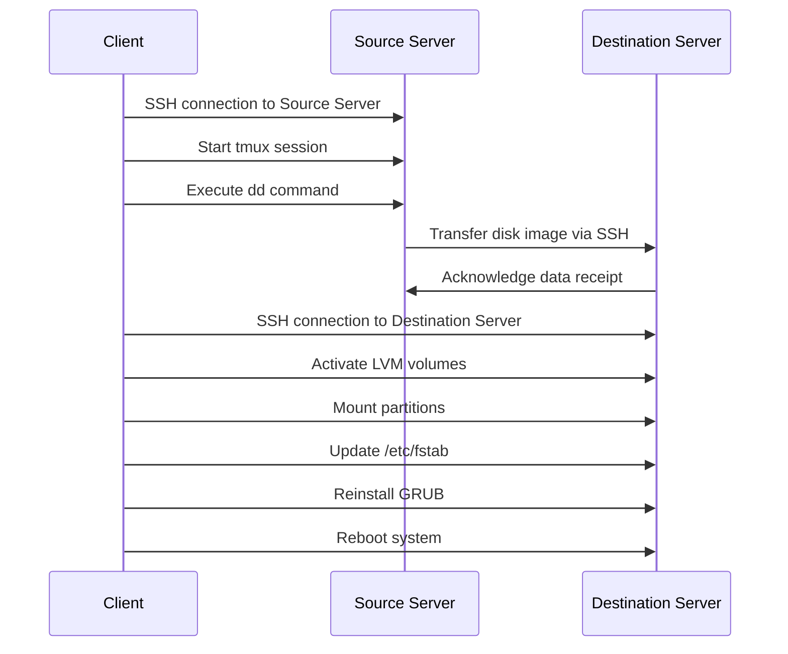

<h1 align="center">📦 Cloning an Ubuntu System Using SSH and `dd`</h1>

## 📚 Table of Contents

- [📚 Table of Contents](#-table-of-contents)
- [📚 Introduction](#-introduction)
- [🎯 Benefits of Using SSH for Cloning](#-benefits-of-using-ssh-for-cloning)
- [🎨 Objectives](#-objectives)
- [🔧 Prerequisites](#-prerequisites)
- [👣 Step-by-Step Guide](#-step-by-step-guide)
  - [1. 📊 Diagram and Network Configuration](#1--diagram-and-network-configuration)
  - [2. 🔄 Preparation on Machine B](#2--preparation-on-machine-b)
  - [3. 🚀 Set Up `tmux` on Client Machine {#tmux-setup}](#3--set-up-tmux-on-client-machine-tmux-setup)
  - [4. 💾 Perform `dd` Clone](#4--perform-dd-clone)
  - [5. 🔄 Post-cloning Procedures on Machine B](#5--post-cloning-procedures-on-machine-b)
- [🎉 Conclusion {#conclusion}](#-conclusion-conclusion)

## 📚 Introduction

System cloning is an essential task that ensures a smooth migration of data and settings from one machine to another. This guide will walk you through the process of cloning an Ubuntu system from Machine A to Machine B using SSH and `dd`. Leveraging SSH provides a secure and encrypted data transfer channel between the two systems, making it a reliable choice for IT professionals.

> [!NOTE]
> In a lab environment, both machines are on the same network. However, in a real-world scenario, as long as Machine A and Machine B can SSH into each other, they can be located on different networks.

## 🎯 Benefits of Using SSH for Cloning

- **🤑 Cost-Effective**: Uses existing network infrastructure; no need for additional hardware.
- **🔒 Secure**: SSH encrypts data across the network, reducing risks of interception.
- **⏳ Minimal Downtime**: Cloning over SSH can be performed remotely, offering flexibility and reducing system downtime.
- **🆓 Open Source Server**: Both SSH and `dd` are open-Source Server tools available on most Linux distributions without additional licensing costs.

## 🎨 Objectives

    - [1. 📊 Diagram and Network Configuration {#diagram-network}](#1--diagram-and-network-configuration-diagram-network)
    - [2. 🔄 Preparation on Machine B {#preparation}](#2--preparation-on-machine-b-preparation)
    - [3. 🚀 Set Up `tmux` on Client Machine {#tmux-setup}](#3--set-up-tmux-on-client-machine-tmux-setup)
    - [4. 💾 Perform `dd` Clone {#dd-clone}](#4--perform-dd-clone-dd-clone)
    - [5. 🔄 Post-cloning Procedures on Machine B {#post-cloning}](#5--post-cloning-procedures-on-machine-b-post-cloning)

## 🔧 Prerequisites

- Two Ubuntu server machines (A and B).
- One client machine for remote connection.
- Machine B should boot from a Live CD for system configuration.
- Ensure network connectivity between all machines.
- SSH access configured between machines.
- Install `tmux` on the client machine to prevent disconnects during long operations.

---

## 👣 Step-by-Step Guide

### 1. 📊 Diagram and Network Configuration

- Diagram:



**Source Server Specs**

```ruby
blkid
/dev/sda2: UUID="8c25bceb-6a04-45d8-9e60-f786fe1e0778" TYPE="ext4" PARTUUID="9a3b0e19-8322-4f5e-9edc-f90b65738d0b"
/dev/sda3: UUID="IZvTo7-LaTh-hX6U-udHF-rchA-heeq-ft6Xla" TYPE="LVM2_member" PARTUUID="be13df45-0673-48d1-9bda-dc3ae8516805"
/dev/mapper/ubuntu--vg-ubuntu--lv: UUID="015ffb9a-4b73-4010-9b73-854ddd6e8c55" TYPE="ext4"

lsblk
NAME                      MAJ:MIN RM  SIZE RO TYPE MOUNTPOINT       
loop0                       7:0    0 91.9M  1 loop /snap/lxd/24061  
loop1                       7:1    0 63.3M  1 loop /snap/core20/1828
loop2                       7:2    0 49.9M  1 loop /snap/snapd/18357
loop3                       7:3    0 38.8M  1 loop /snap/snapd/21759
loop4                       7:4    0   64M  1 loop /snap/core20/2379
loop5                       7:5    0 91.9M  1 loop /snap/lxd/29619  
sda                         8:0    0   25G  0 disk
├─sda1                      8:1    0    1M  0 part
├─sda2                      8:2    0    2G  0 part /boot
└─sda3                      8:3    0   23G  0 part
  └─ubuntu--vg-ubuntu--lv 253:0    0 11.5G  0 lvm  /
sr0                        11:0    1 1024M  0 rom
```

**Destination Server Specs**

```ruby
lsblk
NAME  MAJ:MIN RM   SIZE RO TYPE MOUNTPOINT
loop0   7:0    0   2.2G  1 loop /rofs
loop1   7:1    0     4K  1 loop /snap/bare/5
loop2   7:2    0  63.3M  1 loop /snap/core20/1828
loop3   7:3    0 346.3M  1 loop /snap/gnome-3-38-2004/119   
loop4   7:4    0    46M  1 loop /snap/snap-store/638        
loop5   7:5    0  91.7M  1 loop /snap/gtk-common-themes/1535
loop6   7:6    0  49.9M  1 loop /snap/snapd/18357
sda     8:0    0    25G  0 disk
sr0    11:0    1   4.1G  0 rom  /cdrom
```

- Ensure that SSH is installed and configured on both Machine A and Machine B. Verify network connectivity:
- Ping Machine A and Machine B from the client machine to ensure connectivity.
- Set up SSH keys for password-less login if needed.

### 2. 🔄 Preparation on Machine B

Ensure Machine B is prepared to receive the disk image:

1. Update package lists and install necessary tools (`lvm2`, `grub-pc`).
2. Boot from a Live CD and ensure all partitions are unmounted.

> **⚠️ Note:** Double-check the network connection before proceeding.

### 3. 🚀 Set Up `tmux` on Client Machine {#tmux-setup}

On the client machine, open a `tmux` session to manage the SSH connection:

1. Connect to Machine A using SSH from the client.
2. Start a `tmux` session by running `tmux`.

### 4. 💾 Perform `dd` Clone

Using SSH, clone the disk from Machine A to Machine B:

- From the client machine, within the `tmux` session, execute:

    ```bash
    sudo dd if=/dev/sda bs=64K conv=noerror,sync status=progress | ssh ubuntu@[Machine B IP] "sudo dd of=/dev/sda bs=64K status=progress"
    ```

🔗 Important: Ensure **SSH service is running and using tmux** on both machines.

### 5. 🔄 Post-cloning Procedures on Machine B

After cloning, perform system setup on Machine B:

- Activate LVM Volumes:

    ```bash
    sudo vgscan
    sudo vgchange -ay
    ```

- Mount the Partitions:

    ```bash
    sudo mkdir -p /mnt/root
    sudo mount /dev/mapper/ubuntu--vg-ubuntu--lv /mnt/root
    sudo mkdir -p /mnt/root/boot
    sudo mount /dev/sda2 /mnt/root/boot
    ```

- Check **UUIDs** using **blkid**

    ```ruby
    lsblk
    NAME                      MAJ:MIN RM   SIZE RO TYPE MOUNTPOINT
    loop0                       7:0    0   2.2G  1 loop /rofs
    loop1                       7:1    0     4K  1 loop /snap/bare/5
    loop2                       7:2    0  63.3M  1 loop /snap/core20/1828
    loop3                       7:3    0 346.3M  1 loop /snap/gnome-3-38-2004/119
    loop4                       7:4    0    46M  1 loop /snap/snap-store/638
    loop5                       7:5    0  91.7M  1 loop /snap/gtk-common-themes/1535
    loop6                       7:6    0  49.9M  1 loop /snap/snapd/18357
    sda                         8:0    0    25G  0 disk
    ├─sda1                      8:1    0     1M  0 part
    ├─sda2                      8:2    0     2G  0 part             
    └─sda3                      8:3    0    23G  0 part
    └─ubuntu--vg-ubuntu--lv 253:0    0  11.5G  0 lvm
    sr0                        11:0    1   4.1G  0 rom  /cdrom
    blkid
    /dev/sr0: UUID="2023-03-16-15-57-27-00" LABEL="Ubuntu 20.04.6 LTS amd64" TYPE="iso9660" PTUUID="405a23c7" PTTYPE="dos"     
    /dev/loop0: TYPE="squashfs"
    /dev/loop1: TYPE="squashfs"
    /dev/loop2: TYPE="squashfs"
    /dev/loop3: TYPE="squashfs"
    /dev/loop4: TYPE="squashfs"
    /dev/loop5: TYPE="squashfs"
    /dev/loop6: TYPE="squashfs"
    /dev/sda1: PARTUUID="6534e633-d1a1-43e3-82f2-a5f5fb7b5379"
    /dev/sda2: UUID="8c25bceb-6a04-45d8-9e60-f786fe1e0778" TYPE="ext4" PARTUUID="9a3b0e19-8322-4f5e-9edc-f90b65738d0b"
    /dev/sda3: UUID="IZvTo7-LaTh-hX6U-udHF-rchA-heeq-ft6Xla" TYPE="LVM2_member" PARTUUID="be13df45-0673-48d1-9bda-dc3ae8516805"
    /dev/mapper/ubuntu--vg-ubuntu--lv: UUID="015ffb9a-4b73-4010-9b73-854ddd6e8c55" TYPE="ext4"
    ```

    -  Edit **UUID** in **/etc/fstab**

    ```bash
    sudo nano /mnt/root/etc/fstab
    ```

    ```ruby
    # /etc/fstab: static file system information.
    #
    # Use 'blkid' to print the universally unique identifier for a
    # device; this may be used with UUID= as a more robust way to name devices
    # that works even if disks are added and removed. See fstab(5).
    #
    # <file system> <mount point>   <type>  <options>       <dump>  <pass>
    # / was on /dev/ubuntu-vg/ubuntu-lv during curtin installation
    UUID=015ffb9a-4b73-4010-9b73-854ddd6e8c55 / ext4 defaults 0 1
    # /boot was on /dev/sda2 during curtin installation
    UUID=8c25bceb-6a04-45d8-9e60-f786fe1e0778 /boot ext4 defaults 0 1
    /swap.img       none    swap    sw      0       0
    ```

- Reinstall GRUB for boot configuration:

    ```bash
    sudo mount --bind /dev /mnt/root/dev
    sudo mount --bind /proc /mnt/root/proc
    sudo mount --bind /sys /mnt/root/sys
    sudo chroot /mnt/root
    grub-install /dev/sda
    update-grub
    exit
    ```

- Clean up and reboot the system:

    ```bash
    sudo umount /mnt/root/dev /mnt/root/proc /mnt/root/sys /mnt/root/boot /mnt/root
    sudo reboot
    ```
- Login to Destination Server and check the result
  
  
  Both Source and Destiantion Server are the **same packages, settings**.

## 🎉 Conclusion {#conclusion}

You've successfully cloned an Ubuntu system using SSH and dd. This process ensures a secure and reliable migration with minimal downtime. By following these steps, you're leveraging both the power and flexibility of Linux and open-Source Server tools.

🔔 Final Note: Verify that all settings and data have transferred correctly after rebooting*.
